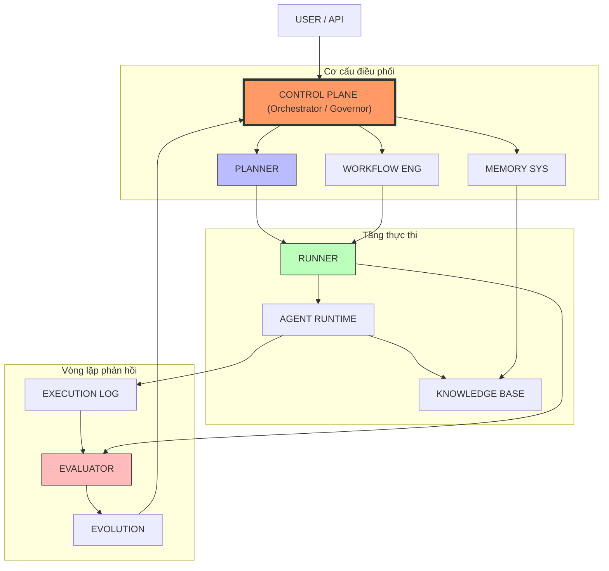
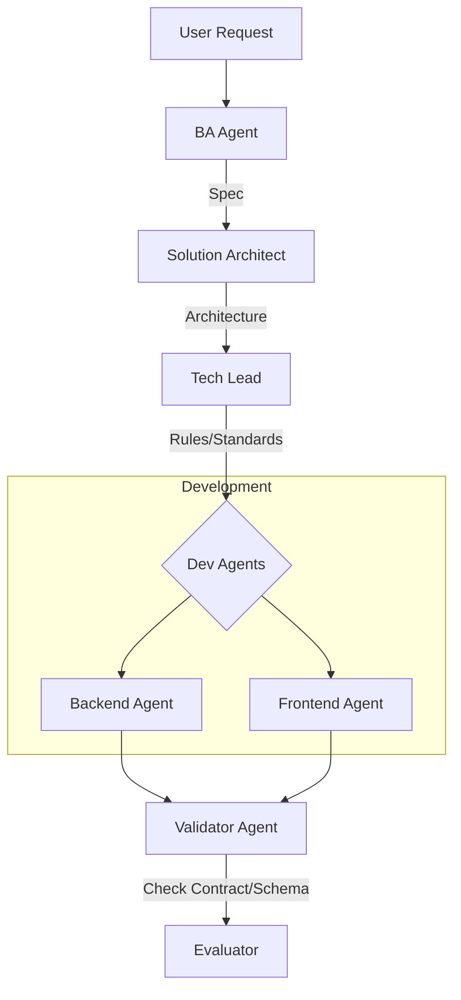
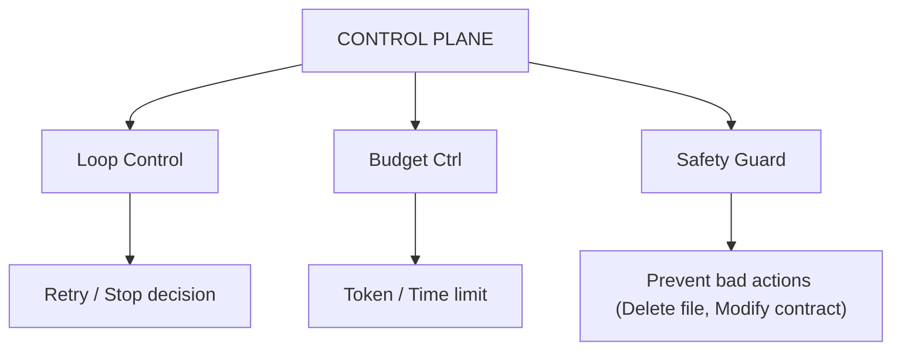
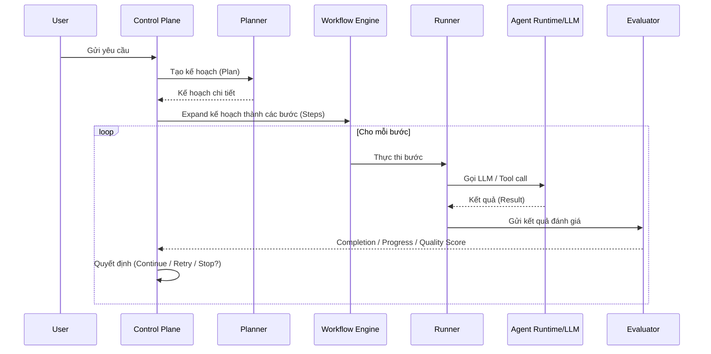
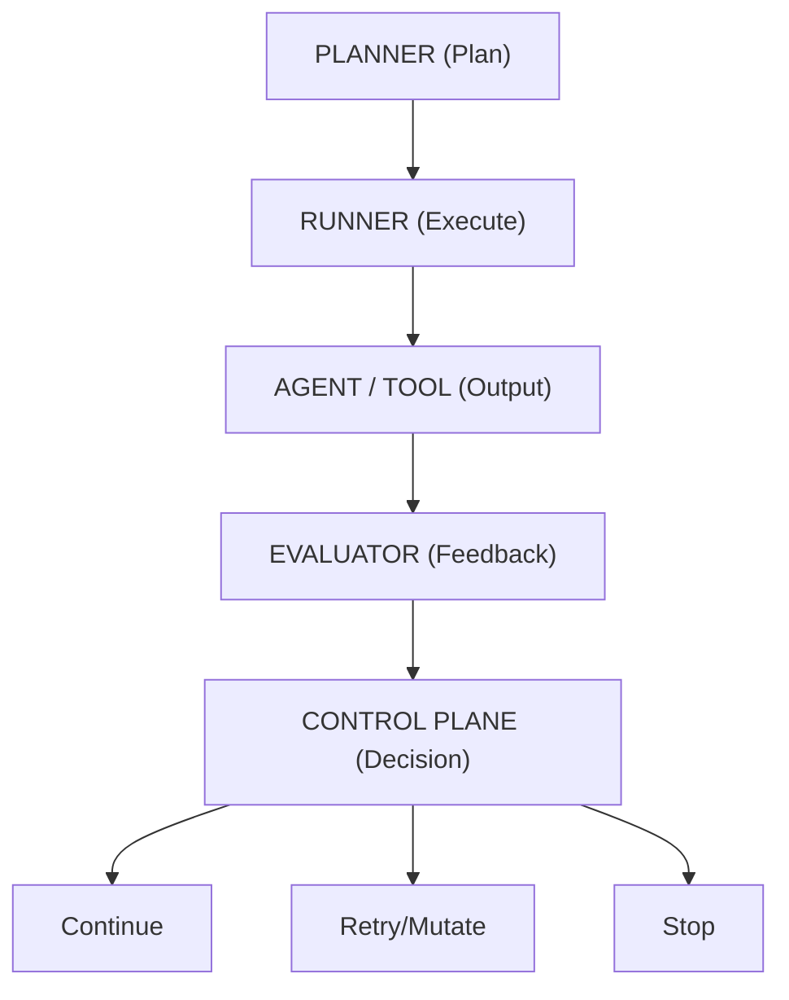
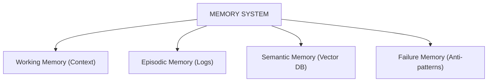
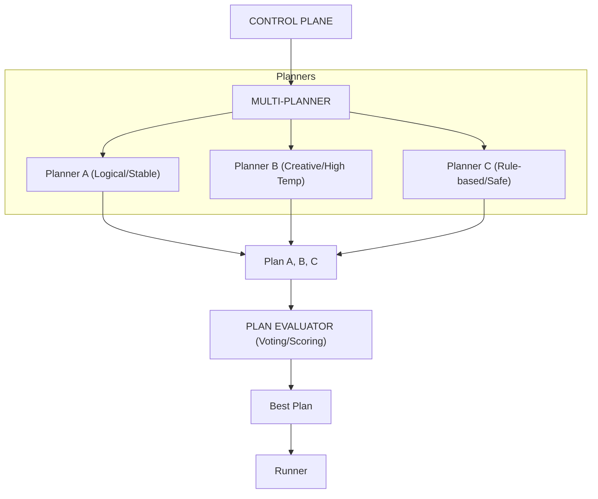
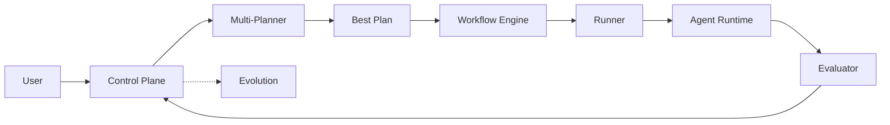

# Hệ thống AI Agent Factory: Bản tổng hợp nghiên cứu & Kinh nghiệm thực tế

Tài liệu này định hình tư duy và kiến trúc cốt lõi để xây dựng một Agent Factory - hệ thống meta có khả năng sinh, quản trị và tự nâng cấp các AI Agent.

---

## Mục lục (Table of Contents)
- [1. Bản chất bài toán](#1-bản-chất-bài-toán)
- [2. Kiến trúc tổng thể (High-level Architecture)](#2-kiến-trúc-tổng-thể-high-level-architecture)
- [3. Khái niệm cốt lõi: Config-driven everything](#3-khái-niệm-cốt-lõi-config-driven-everything)
- [4. Định nghĩa AI Agent (Agent Schema)](#4-định-nghĩa-ai-agent-agent-schema)
- [5. Các Agent cần thiết (Phiên bản 1)](#5-các-agent-cần-thiết-phiên-bản-1)
- [6. Động cơ quy trình (Workflow Engine)](#6-động-cơ-quy-trình-workflow-engine)
- [7. Control Plane (Lớp điều phối & Quản trị) - [Mới]](#7-control-plane-lớp-điều-phối--quản-trị---mới)
- [8. Runner (Bộ thực thi)](#8-runner-bộ-thực-thi)
- [9. Bộ lập hoạch (Planner) - [Nâng cấp: Hierarchical]](#9-bộ-lập-hoạch-planner---nâng-cấp-hierarchical)
- [10. Hệ thống bộ nhớ (Memory System) - [Nâng cấp: Trí tuệ sai lầm]](#10-hệ-thống-bộ-nhớ-memory-system---nâng-cấp-trí-tuệ-sai-lầm)
- [11. Bộ đánh giá (Evaluator) - [Nâng cấp: Phân tầng chỉ số]](#11-bộ-đánh-giá-evaluator---nâng-cấp-phân-tầng-chỉ-số)
- [12. Vòng lặp tự học (Self-Evolution Loop)](#12-vòng-lặp-tự-học-self-evolution-loop)
- [13. Các quy tắc thực chiến (Best Practices)](#13-các-quy-tắc-thực-chiến-best-practices)
- [14. Lộ trình phát triển nâng cao (The Ultimate Roadmap)](#14-lộ-trình-phát-triển-nâng-cao-the-ultimate-roadmap)
  - [14.1. Tổng quan lộ trình](#141-tổng-quan-lộ-trình)
  - [14.2. Chi tiết từng giai đoạn](#142-chi-tiết-từng-giai-đoạn)
- [15. Lịch trình thực hiện dự kiến](#15-lịch-trình-thực-hiện-dự-kiến)
- [16. Các mốc quan trọng (Milestones)](#16-các-mốc-quan-trọng-milestones)
- [17. Lưu ý thực tế (Reality Check)](#17-lưu-ý-thực-tế-reality-check)
- [18. Công cụ công nghệ gợi ý (Tech Stack)](#18-công-cụ-công-nghệ-gợi-ý-tech-stack)
- [19. Tầm nhìn dài hạn](#19-tầm-nhìn-dài-hạn)
- [20. Tổng kết kinh nghiệm thực chiến (Lessons Learned)](#20-tổng-kết-kinh-nghiệm-thực-chiến-lessons-learned)
  - [20.1. Cấu hình hệ thống hướng tới Autonomous Agent (Tiến hóa Phase 2+)](#201-cấu-hình-hệ-thống-hướng-tới-autonomous-agent-tiến-hóa-phase-2)
  - [20.2. So sánh Trạng thái thực tế (Dự án AHV) với Mô hình Nâng cấp](#202-so-sánh-trạng-thái-thực-tế-dự-án-ahv-với-mô-hình-nâng-cấp)
- [21. Thuật ngữ cốt lõi & Từ khóa ấn tượng (Core Keywords)](#21-thuật-ngữ-cốt-lõi--từ-khóa-ấn-tượng-core-keywords)
  - [21.1. Nhóm từ khóa vận hành hệ thống](#211-nhóm-từ-khóa-vận-hành-hệ-thống)
  - [21.2. Nhóm từ khóa "Thực chiến"](#212-nhóm-từ-khóa-thực-chiến)
  - [21.3. Hướng nghiên cứu & Triển khai tương lai](#213-hướng-nghiên-cứu--triển-khai-tương-lai)

---

## 1. Bản chất bài toán
Hệ thống này không đơn thuần là một hệ thống AI Agent thông thường. Đây là một Meta-System (Hệ thống của các hệ thống).

- **Không phải**: Hardcode các Agent để làm việc.
- **Là**: Một nhà máy (Factory) có khả năng tạo ra đội ngũ Agent theo yêu cầu và hướng dẫn chúng tự tiến hóa.

### Ba tầng chính (Layers)
1.  **Layer 1: Agent Runtime (Execution)**: Môi trường thực thi các nhiệm vụ cụ thể.
2.  **Layer 2: Agent Definition (Config-driven roles)**: Định nghĩa vai trò qua cấu hình, không thông qua mã nguồn.
3.  **Layer 3: Meta Evolution System (Self-improve)**: Vòng lặp tự đánh giá và nâng cấp.

> [!NOTE]
> **Reality Check (Dự án AHV)**: Việc thiết lập Layer 3 là khó nhất. Nếu không có cơ chế `markSuccess` thông minh (dựa trên **Evaluator's Progress Check**), hệ thống sẽ bị kẹt trong vòng lặp vô tận. Kiến trúc **Control Plane** ra đời để giải quyết chính xác bài toán điều phối vòng lặp này.

---

## 2. Kiến trúc tổng thể (High-level Architecture)

Để hình dung cách hệ thống vận hành như một "Nhà máy phần mềm", dưới đây là sơ đồ kết nối giữa các thành phần cốt lõi:



> [!TIP]
> **Insight quan trọng**: Control Plane đóng vai trò là "não bộ" thực sự. Planner chỉ là thực thể đề xuất phương án, trong khi Evaluator cung cấp dữ liệu kiểm soát. Quyết định cuối cùng luôn thuộc về Control Plane.

### Cấu trúc lưu trữ tài liệu chuẩn
```text
/
 ├── 01-Research/               # Các giai đoạn nghiên cứu (Phase-based)
 ├── 02-Architecture/            # Kiến trúc tổng thể và Whitepapers
 ├── 03-Implementation-Specs/    # Tài liệu đặc tả kỹ thuật triển khai
 ├── 04-Case-Studies/            # Các bài học kinh nghiệm thực tế
 ├── 05-Standards-Guidelines/    # Tiêu chuẩn và Quy trình
 └── 06-Applications/            # Tài liệu về các ứng dụng thực tế
```

> [!NOTE]
> **Reality Check (Dự án AHV)**: Cấu trúc thư mục thực tế có thể biến động tùy theo Stack (ví dụ: `frontend/` nằm tách biệt với `src/backend/`). Đây là lý do kiến trúc mới cần **Control Plane** có cơ chế giám sát *Folder Fragmentation* để tự động chuẩn hóa lại cấu trúc khi Agent tự ý rẽ nhánh.

---

## 3. Khái niệm cốt lõi: Config-driven everything
Đây là yếu tố then chốt của Agent Factory.

- **Định nghĩa Config-driven**: Thay vì viết mã nguồn theo dạng kiểm tra điều kiện cứng, mọi hành vi được định nghĩa trong tệp cấu hình (YAML/JSON).
- **Lợi ích**:
    - Thêm Agent mới: Không cần viết thêm mã nguồn.
    - Thay đổi hành vi: Chỉnh sửa tệp cấu hình.
    - Kích hoạt khả năng tự tiến hóa: Hệ thống tự điều chỉnh cấu hình để đạt hiệu quả cao hơn.

> [!NOTE]
> **Reality Check (Dự án AHV)**: "Config-driven" có thể dẫn tới sự mâu thuẫn giữa các tệp cấu hình mới và mã nguồn cũ (Design Drift). Giải pháp kiến trúc là sử dụng **Validator Agent** để thực thi *Immutable Contract*, "khóa" thiết kế dưới sự điều phối của **Control Plane** ngay sau khi Phase Design kết thúc.

---

## 4. Định nghĩa AI Agent (Agent Schema)
Một Agent chuẩn vận hành thực tế cần có đầy đủ các thuộc tính sau:

```yaml
id: backend_senior
persona:
  role: Senior Backend Engineer
  tone: pragmatic, performance-focused
  experience: 8+ years
goals:
  - build scalable backend
  - ensure code quality
capabilities:
  - api_design
  - db_schema_design
tools:
  - code_generator
  - db_analyzer
rules:
  - follow_clean_architecture
  - write_unit_tests
memory:
  type: vector
  scope: project
evaluation:
  metrics: [code_quality, performance]
```

---

## 5. Các Agent cần thiết (Phiên bản 1)
Bắt đầu với bộ khung tối thiểu (Minimal Set):

- **BA Agent**: Chuyển ý tưởng thành đặc tả (Specification).
- **SA Agent (Solution Architect)**: Thiết kế kiến trúc hệ thống.
- **Tech Lead Agent**: Định nghĩa tiêu chuẩn và kiểm duyệt mã nguồn.
- **Backend/Frontend Senior Agents**: Thực thi lập trình.

> [!NOTE]
> **Reality Check (Dự án AHV)**: Sự phối hợp giữa Backend và Frontend Agent thường xảy ra xung đột ở giai đoạn tích hợp (Integration). Cần có một **Xác thực (Validation)** Agent chuyên biệt để kiểm tra API Contract và Schema.



> [!IMPORTANT]
> **Validator Agent** là bắt buộc để ngăn chặn hiện tượng trôi dạt thiết kế bằng cách kiểm tra sự khớp nối giữa API Contract và thực tế triển khai.

---

## 6. Động cơ quy trình (Workflow Engine)
Cơ chế điều phối các Agent phối hợp thực hiện nhiệm vụ.

### Ví dụ quy trình (Pipeline):
Ý tưởng -> BA (Spec) -> SA (Arch) -> TechLead (Rules) -> Devs (Code) -> Evaluator (Scoring) -> Feedback (Evolution).

### Cấu hình Workflow mẫu:
```yaml
workflow:
  name: build_feature
  steps:
    - agent: ba
      task: analyze
    - agent: solution_architect
      task: design
    - parallel:
        - agent: backend
          task: implement
        - agent: frontend
          task: implement
```

---

## 7. Control Plane (Lớp điều phối & Quản trị) - [Mới]
**Vai trò**: Là bộ não quản trị cấp cao, chịu trách nhiệm về an toàn, ngân sách và tính nhất quán của toàn bộ hệ thống.

- **Nhiệm vụ trọng tâm**:
    - **Loop Governance**: Quyết định khi nào dừng vòng lặp, khi nào cần "Escalate" (yêu cầu con người can thiệp).
    - **Budget Control**: Kiểm soát chi phí (Token usage) và thời gian thực thi.
    - **Safety Guardrails**: Đảm bảo các Agent không thực hiện các hành vi nguy hiểm hoặc vi phạm chính sách bảo mật.
    - **Phase Gating Authority**: Quyết định cuối cùng về việc chuyển đổi giữa các Phase (ví dụ: từ Backend sang Frontend).



> [!NOTE]
> **Reality Check (Dự án AHV)**: Trong giai đoạn này, vai trò **Control Plane** (điều phối vòng lặp, kiểm soát ngân sách) chủ yếu do **Antigravity** đảm nhận thủ công. Kiến trúc này được thiết kế để tự động hóa hoàn toàn các quyết định "Escalate" và "Stop" trong các phase tiếp theo.

---

## 8. Runner (Bộ thực thi)
**Vai trò**: Là cánh tay trực tiếp thực hiện các chỉ lệnh từ Planner và thực thi các thao tác nguyên tử trên môi trường.

- **Nhiệm vụ trọng tâm**:
    - **Execution (Atomic Tasks)**: Chạy script, cài đặt dependency, hoặc ghi file.
    - **Completion Check (Xong chưa?)**: Xác nhận nhiệm vụ kỹ thuật đã hoàn thành (ví dụ: File đã tồn tại, Server đã khởi động).

> [!IMPORTANT]
> **Sự tách bạch về Xác thực (Validation Split)**: 
> Trong mô hình nâng cấp, Runner **không** tự chấm điểm chất lượng. Nó chỉ xác nhận việc "thực thi thành công". Trách nhiệm đánh giá "tiến bộ" và "chất lượng" sẽ được đẩy lên lớp Evaluator.

> [!NOTE]
> **Reality Check (Dự án AHV)**: Trong thiết kế ban đầu (Iteration 1-10), Runner bị "overload" trách nhiệm khi phải tự xác nhận thành công qua số lượng issue. Điều này đã dẫn đến "vòng lặp vô tận" khi số issue không giảm.

### Luồng vận hành (Component Interaction Flow)



---

## 9. Bộ lập hoạch (Planner) - [Nâng cấp: Hierarchical]
Planner không còn là một thực thể đơn nhất mà được phân thành các tầng kiến trúc để đảm bảo tính bền vững:

- **Strategic Planner (Chiến lược)**: Xác định mục tiêu tổng thể của sản phẩm (Roadmap).
- **Task Decomposer (Phần chia)**: Chia nhỏ Roadmap thành các nhiệm vụ cụ thể cho từng Agent.
- **Execution Planner (Thực thi/Tactical)**: Xử lý các tình huống retry, lựa chọn Agent thay thế khi có lỗi tại chỗ.



> [!NOTE]
> **Reality Check (Dự án AHV)**: Việc sử dụng Single Planner trong dự án AHV đã bộc lộ điểm yếu "Hallucination" (ảo giác) - tự tạo ra các bước thừa hoặc nhảy cóc. Mô hình **Hierarchical Planner (Strategic vs Tactical)** chính là giải pháp kiến trúc để thay thế hoàn toàn các Checkpoint phê duyệt thủ công.

---

## 10. Hệ thống bộ nhớ (Memory System) - [Nâng cấp: Trí tuệ sai lầm]
Hệ thống bộ nhớ được mở rộng để không chỉ "nhớ" mà còn phải "rút kinh nghiệm":

1.  **Working Memory (Ngữ cảnh tức thời)**: Tương tự `state.json`, lưu trữ trạng thái hiện tại.
2.  **Episodic Memory (Lịch sử trải nghiệm)**: Nhật ký chi tiết của các lần chạy (Run History) để so sánh hiệu quả giữa các phiên bản.
3.  **Failure Memory (Bộ nhớ sai lầm)**: Lưu trữ các "Anti-patterns" - những cách làm đã thử và thất bại để AI không lặp lại cùng một lỗi (Ví dụ: "Không được cài đặt version X của thư viện Y vì xung đột").



> [!NOTE]
> **Reality Check (Dự án AHV)**: Sự thiếu hụt Failure Memory trong dự án AHV khiến AI lặp lại lỗi dependency cho đến khi được con người nhắc nhở (Manual Note). Việc tích hợp **Failure Memory (Anti-patterns DB)** là bước ngoặt giúp hệ thống tự học từ thất bại và vận hành autonomous hoàn toàn.

---

## 11. Bộ đánh giá (Evaluator) - [Nâng cấp: Phân tầng chỉ số]
Thay vì chỉ là Success/Fail, Evaluator trong mô hình nâng cấp thực hiện:
- **Progress Check (Delta)**: So sánh kết quả hiện tại với trạng thái trước đó (Mã nguồn có tốt lên không? Độ bao phủ test có tăng không?).
- **Quality Score (Scoring)**: Chấm điểm dựa trên Rubric chuẩn (Clean code, Security, Performance).

---

## 12. Vòng lặp tự học (Self-Evolution Loop)
Vòng lặp cốt lõi: Thực thi -> Đánh giá -> Phân tích -> Điều chỉnh -> Tái thực thi.

> [!IMPORTANT]
> **Evolution Safety (An toàn tiến hóa)**: 
> Cần cơ chế **Shadow Testing** (chạy thử cấu hình mới trong môi trường cô lập) và **Auto-Rollback** nếu cấu hình mới làm giảm điểm số Evaluator bền vững.

> [!NOTE]
> **Reality Check (Dự án AHV)**: Việc Antigravity phải can thiệp trực tiếp để đổi Runner logic trong dự án AHV chính là tiền thân của cơ chế **Shadow Testing** và **Auto-Rollback** trong kiến trúc nâng cao. Trong tương lai, **Control Plane** sẽ tự động hóa việc này để đảm bảo Evolution Safety.

---

## 13. Các quy tắc thực chiến (Best Practices)
- **Tiếp cận từng bước**: Tránh xây dựng hệ thống đa Agent phức tạp ngay từ đầu. Hãy bắt đầu với luồng vận hành cố định và tích hợp AI dần dần.
- **Quản lý phiên bản**: Lưu trữ mọi phiên bản cấu hình (ví dụ: `backend_v1.yaml`, `backend_v2.yaml`).
- **Ghi nhật ký (Logging)**: Ghi lại chi tiết dữ liệu đầu vào, đầu ra và thời gian phản hồi của từng Agent.
- **Sự can thiệp của con người (Human-in-the-loop)**: Giai đoạn đầu cần có sự phê duyệt của con người trước khi hệ thống thực hiện cập nhật tự động.

> [!NOTE]
> **Reality Check (Dự án AHV)**: Trong thực tế, Antigravity (Advanced Agent) đóng vai trò là "người can thiệp" để chỉnh sửa cấu hình hệ thống khi các Agent Factory bị kẹt (Manual Override).

---

## 14. Lộ trình phát triển nâng cao (The Ultimate Roadmap)

### 14.1. Tổng quan lộ trình
1.  **Phase 1 - Foundation**: Runtime, Config loader, Logging.
2.  **Phase 2 - Multi-agent**: Workflow engine, Context passing.
3.  **Phase 3 - Evaluation & Governance**: Orchestrator (Control Plane), Scoring system.
4.  **Phase 4 - Antigravity (Evolution)**: Config mutation, Evolution Safety.
5.  **Phase 5 - Optimization**: Parallel execution, Multi-Planner.

---

### 14.2. Chi tiết từng giai đoạn

### Phase 1: Foundation (Core Runtime)
**Mục tiêu**: Vận hành được Agent đơn lẻ theo kịch bản cố định.
- **Nhiệm vụ trọng tâm**:
    - **Agent Runtime**: Xây dựng API thực thi Agent.
    - **Config Loader**: Tự động tải cấu hình từ thư mục `/configs`.
    - **Simple Executor**: Thực thi tuần tự các bước.
    - **Logging system**: Ghi nhật ký chi tiết các phiên làm việc.
- **Kết quả đầu ra**: Agent đọc cấu hình và thực thi đúng kịch bản logic.
- **Rủi ro**: Viết mã nguồn cứng (hardcode) thay vì sử dụng cấu hình; thiếu hệ thống nhật ký dẫn đến khó khăn khi gỡ lỗi.
- **Phạm vi loại trừ**: Tạm thời chưa triển khai đa Agent, bộ lập hoạch động hoặc cơ chế tiến hóa.

> [!NOTE]
> **Reality Check (Dự án AHV)**: Giai đoạn Foundation thường mất thời gian nhất ở việc thiết lập môi trường (Dependencies, Configs). Đừng coi thường việc cài đặt `npm` hay `tsconfig`.

### Phase 2: Multi-agent System
**Mục tiêu**: Phối hợp nhiều Agent theo một quy trình cụ thể.
- **Nhiệm vụ trọng tâm**:
    - **Workflow Engine**: Quản lý trình tự phối hợp giữa các Agent.
    - **Context Passing**: Chuyển giao dữ liệu đầu ra của Agent trước làm đầu vào cho Agent sau.
    - **Basic Planner**: Lập kế hoạch dựa trên quy tắc (Rule-based).
- **Đội ngũ Agent tối thiểu**: BA, Backend, Frontend.
- **Kết quả đầu ra**: Quy trình hoàn chỉnh từ Ý tưởng -> BA -> Backend -> Frontend.
- **Rủi ro**: Quá tải ngữ cảnh (context overload) hoặc các Agent làm việc chồng chéo.
- **Giải pháp**: Định nghĩa rõ ràng cấu trúc dữ liệu đầu vào và đầu ra.

> [!NOTE]
> **Reality Check (Dự án AHV)**: Việc chuyển giao ngữ cảnh (Context Passing) cần được nén lại. Nếu không có cơ chế **Context Purging** (Thanh lọc ngữ cảnh) hiệu quả, Agent sẽ bị loãng mục tiêu do nhồi nhét quá nhiều file cũ vào bộ nhớ.

### Phase 3: Evaluation System
**Mục tiêu**: Thiết lập cơ chế định lượng để hệ thống biết chính xác kết quả nào là "tốt" hoặc "chưa tốt".
- **Nhiệm vụ trọng tâm**:
    - **Evaluator (Bộ đánh giá)**: Triển khai engine đánh giá đa tầng. Tầng 1 dùng các công cụ định lượng (Linter, Test Runner, SonarQube). Tầng 2 dùng LLM rà soát logic dựa trên bộ tiêu chí (Rubric) có sẵn.
      > [!NOTE]
      > **Reality Check (Dự án AHV)**: Đã triển khai Sandbox (Tầng 1 - Integration) và LLM Reasoning (Tầng 2 - Logic), nhưng chưa tích hợp Linter/SonarQube thành một khối đánh giá độc lập.
    - **Metrics system (Hệ thống chỉ số)**: Xác định bộ chỉ số KPI chi tiết:
        - Khối lượng lỗi (Bug count).
        - Độ phức tạp của mã nguồn (Cyclomatic complexity).
        - Hiệu năng (Latency, Resource usage).
        - Sự tuân thủ phong cách (Style compliance).
      > [!NOTE]
      > **Reality Check (Dự án AHV)**: Chỉ mới triển khai kiểm tra trạng thái thực thi (Success/Fail) và Bug count cơ bản. Các chỉ số về Complexity hay Performance chưa được định lượng tự động.
    - **Feedback storage (Lưu trữ phản hồi)**: Xây dựng cơ sở dữ liệu lưu trữ toàn bộ lịch sử đánh giá. Mỗi bản ghi bao gồm: `task_id`, `agent_id`, `original_output`, `score`, `reasoning` và `suggestions`.
      > [!NOTE]
      > **Reality Check (Dự án AHV)**: Phản hồi đang được lưu trữ phi tập trung trong `state.json` và `meta.json`. Chưa có Database chuyên biệt để truy vấn lịch sử tiến hóa của Agent.
- **Kết quả đầu ra**: Mọi phiên thực thi đều đi kèm một bản báo cáo đánh giá (Evaluation Report) với điểm số cụ thể. Đây là dữ liệu đầu vào quan trọng cho quá trình tự tiến hóa ở Phase 4.
- **Rủi ro**: Tiêu chí đánh giá quá định tính (không rõ ràng) hoặc LLM đánh giá không nhất quán qua các lần chạy khác nhau.
- **Giải pháp**: Xây dựng bộ tiêu chuẩn (Standard Rubric) nghiêm ngặt và sử dụng các công cụ kiểm tra tự động (deterministic tools) nhiều nhất có thể trước khi dùng LLM.

### Phase 4: Antigravity (Self-evolve)
**Mục tiêu**: Hệ thống tự cải thiện hiệu quả vận hành theo thời gian.
- **Nhiệm vụ trọng tâm**:
    - **Feedback Analyzer**: Phân tích các lỗi lặp lại để tìm ra quy luật.
    - **Config Mutator**: Tự động tinh chỉnh cấu hình và các chỉ dẫn (prompts).
    - **Version Manager**: Quản lý các thế hệ cấu hình Agent khác nhau.
- **Quy trình hoàn chỉnh**: Thực thi -> Đánh giá -> Phân tích -> Điều chỉnh -> Tái thực thi.
- **Rủi ro**: Điều chỉnh quá mức gây mất ổn định hệ thống.
- **Giải pháp**: Bắt buộc thử nghiệm trên phiên bản mới trước khi áp dụng chính thức.

### Phase 5: Optimization & Scaling
**Mục tiêu**: Hệ thống tối ưu hiệu suất và sẵn sàng triển khai quy mô lớn.
- **Nhiệm vụ trọng tâm**:
    - **Parallel execution**: Thực thi song song các nhiệm vụ độc lập.
    - **Queue system**: Quản lý hàng đợi và cơ chế thử lại nhiệm vụ lỗi.
    - **Caching**: Tái sử dụng kết quả cũ để giảm chi phí vận hành.

> [!NOTE]
> **Reality Check (Dự án AHV)**: Tối ưu hóa quan trọng nhất là đảm bảo các Agent không ghi đè lên các tệp tin của nhau và quản lý tài nguyên hệ thống đồng nhất.
    - **Advanced Planner**: Lập kế hoạch động dựa trên LLM.
- **Kết quả đầu ra**: Hệ thống vận hành nhanh hơn, tiết kiệm chi phí và thông minh hơn.

---

## 15. Lịch trình thực hiện dự kiến
- **Tuần 1-2**: Agent runtime, hệ thống cấu hình và nhật ký.
- **Tuần 3-4**: Động cơ quy trình và phối hợp đa Agent cơ bản.
- **Tuần 5-6**: Bộ đánh giá và lưu trữ phản hồi.
- **Tuần 7-8**: Cấu trúc Antigravity phiên bản 1 (bán tự động).
- **Tuần 9 trở đi**: Tối ưu hóa và mở rộng quy mô.

## 16. Các mốc quan trọng (Milestones)
1.  **M1**: Agent chạy thành công hoàn toàn từ cấu hình.
2.  **M2**: Quy trình phối hợp đa Agent vận hành ổn định.
3.  **M3**: Thiết lập hệ thống chấm điểm đáng tin cậy.
4.  **M4**: Hệ thống thực hiện những bước tự cải thiện đầu tiên.

## 17. Lưu ý thực tế (Reality Check)
- **Sai lầm phổ biến**: Tập trung vào khả năng tự tiến hóa (Phase 4) khi nền tảng vận hành (Phase 1, 2) chưa thực sự ổn định.
- **Nguyên tắc cốt lõi**: Ưu tiên xây dựng một hệ thống ổn định trước khi phát triển các tính năng thông minh.

---

## 18. Công cụ công nghệ gợi ý (Tech Stack)
- **Ngôn ngữ lập trình**: Node.js hoặc Python (FastAPI).
- **Cơ sở dữ liệu**: MongoDB (Nhật ký/Bộ nhớ), Redis (Hàng đợi), Qdrant/Weaviate (Vector DB).

---

## 19. Tầm nhìn dài hạn
Khi được triển khai đúng hướng, hệ thống sẽ trở thành một AI Software Company thu nhỏ, có khả năng tự tổ chức đội ngũ, thực hiện dự án và không ngừng hoàn thiện qua từng sản phẩm.

---

## 20. Tổng kết kinh nghiệm thực chiến (Lessons Learned)

> [!IMPORTANT]
> Đây là các bảng tổng hợp được đúc kết từ quá trình can thiệp thực tế của **Antigravity** để tối ưu hóa hệ thống hướng tới trạng thái Autonomous hoàn toàn.

### 20.1. Cấu hình hệ thống hướng tới Autonomous Agent (Tiến hóa Phase 2+)

Dưới đây là các cấu hình then chốt mang tính chiến thuật, được điều chỉnh để giúp hệ thống từ vận hành tuần tự sang khả năng tự điều phối và tiến hóa (Autonomous):

| Thành phần hệ thống | Cấu hình ban đầu | Cấu hình tiến hóa | Mục tiêu hướng tới Autonomous |
| :--- | :--- | :--- | :--- |
| **Bản phân tầng (Planner)** | Bộ lập hoạch đơn nhất (Single). | **Hierarchical Planner** | Tách biệt Chiến lược (Strategic) và Thực thi (Tactical) để giảm Hallucination. |
| **Logic Thành công (Runner)** | Fix lỗi dựa trên số lượng issue. | **Triple-Check Validation** | Tách bạch: Completion vs Progress vs Quality để có Evaluation chính xác. |
| **Quản lý bối cảnh (Memory)** | Lưu trữ mọi Iteration cũ. | **Episodic & Failure Memory** | Ghi nhớ các "Anti-patterns" để không lặp lại sai lầm cũ. |
| **Lớp điều phối (Orchestrator)** | Con người/Agent cấp cao điều khiển. | **Control Plane (Automated)** | Tự động hóa việc quản lý Loop, Budget và Safety Guardrails. |
| **Tiến hóa (Evolution)** | Thay đổi cấu hình trực tiếp. | **Shadow & Canary Release** | Đảm bảo cấu hình mới không làm "thoái hóa" hệ thống. |

> [!TIP]
> Sự thay đổi từ *Cấu hình cứng* sang *Cấu hình động theo ngữ cảnh* là bước ngoặt để nhà máy Agent có thể tự "ra quyết định" và chuyển đổi trạng thái mà không cần sự can thiệp của con người.

### 20.2. So sánh Trạng thái thực tế (Dự án AHV) với Mô hình Nâng cấp

| Đặc tính Nâng cấp | Trạng thái hiện tại (AHV) | Đánh giá | Ghi chú từ thực tế |
| :--- | :--- | :--- | :--- |
| **Control Plane** | Thủ công (qua Antigravity) | **Khớp 20%** | Mới dừng ở mức con người giám sát, chưa có engine tự động. |
| **Triple-Check Validator** | Success/Fail (Binary) | **Khớp 40%** | Đã biết check "tiến bộ" (delta) nhưng chưa scoring chất lượng chuyên sâu. |
| **Hierarchical Planner** | Single Dynamic Planner | **Khớp 50%** | Phân chia task tốt nhưng dễ bị lẫn lộn giữa chiến lược và thực thi. |
| **Failure Memory** | Manual Notes | **Khớp 10%** | Chỉ nhớ sai lầm qua ghi chú của bác và tôi, chưa có DB Anti-patterns. |
| **Shadow Testing** | Chạy trực tiếp | **Khớp 0%** | Chưa thực hiện chạy cấu hình song song. |

- **Kết luận**: Dự án AHV đang tiệm cận Phase 3 nhưng vận hành theo cơ chế **Binary Evaluation (Success/Fail)** hơn là **Quantitative Evaluation (Scoring)**. Để đạt chuẩn Phase 3, cần tích hợp thêm các công cụ static analysis (như SonarQube) và hệ thống lưu trữ điểm số.

---

## 21. Thuật ngữ cốt lõi & Từ khóa ấn tượng (Core Keywords)

Đây là những khái niệm "xương sống" và các bài học "xương máu" đã định hình nên sự thành công của dự án AHV:

### 21.1. Nhóm từ khóa vận hành hệ thống
- **Auto-Fix Loop (Vòng lặp tự chữa lành)**: Không chỉ là sửa lỗi, đây là chu trình khép kín: "Phân tích Log -> Hiệu chỉnh kế hoạch -> Viết lại code -> Tái xác thực". Đây chính là động cơ giúp AI tự vượt qua các rào cản kỹ thuật mà không cần con người viết từng dòng lệnh.
- **Pipeline (Dòng chảy đa Agent)**: Là một "State-machine" (Máy trạng thái) của các Agent. Đầu ra của Agent này (ví dụ: Spec của BA) trở thành bối cảnh (Context) không thể thiếu cho Agent sau (Dev), đảm bảo tính nhất quán xuyên suốt dự án.
- **Runner (Trái tim vận hành)**: Engine thực thi các lệnh nguyên tử và thực hiện các bài kiểm tra thực thi (Completion Check) để quyết định bước tiếp theo.
- **Planner (Kiến trúc sư lập kế hoạch)**: Bộ não ra quyết định mang tính đệ quy, hiện đã được nâng cấp lên mô hình Hierarchical (Strategic -> Tactical).
- **Control Plane (Tháp điều phối)**: Lớp quản trị cao nhất, giữ quyền năng về Loop, Budget và Safety.
- **Contract (Hợp đồng giao tiếp)**: Ngôn ngữ chung giữa các Agent (API Spec, DB Schema). Contract là "mỏ neo" giữ cho dự án không bị chệch hướng.
- **SDLC Full (Vòng đời phần mềm toàn diện)**: Khả năng bao quát từ Phân tích yêu cầu -> Thiết kế kiến trúc -> Lập trình -> Kiểm thử -> Viết tài liệu.

### 21.2. Nhóm từ khóa "Thực chiến"
- **Context Purging (Thanh lọc ngữ cảnh)**: Kỹ thuật dọn dẹp bộ nhớ lỗi. Nếu AI "nhớ" quá nhiều thất bại trong quá khứ, nó sẽ bị ám ảnh và không thể tập trung vào giải pháp hiện tại.
- **Design Drift (Trôi dạt thiết kế)**: Hiện tượng AI tự ý thay đổi cấu trúc nền tảng trong các lượt Iteration muộn. Cần cơ chế Immutable Contract để ngăn chặn.
- **Manual Override (Can thiệp tối cao)**: Sự thừa nhận rằng trong Phase 1-2, luôn cần một "Senior Agent" hoặc con người để phá vỡ các vòng lặp logic bế tắc.
- **State Desync (Lệch pha trạng thái)**: Khi "thế giới quan" của AI (trong file `state.json`) khác với thực tế tệp tin trên đĩa cứng.
- **Glassmorphism Premium (Tiêu chuẩn thẩm mỹ cao cấp)**: Minh chứng cho khả năng cảm thụ và thực thi các phong cách thiết kế hiện đại của AI.

### 21.3. Hướng nghiên cứu & Triển khai tương lai
- **Multi-Planner (Đa bộ lập kế hoạch)**: Là phương pháp sử dụng nhiều planner hoạt động song song để sinh ra các phương án kế hoạch khác nhau. Các kế hoạch này sau đó được đánh giá thông qua cơ chế lựa chọn (scoring, voting hoặc verifier) nhằm chọn ra phương án tối ưu. Cách tiếp cận này giúp tăng tính đa dạng của lời giải, cải thiện độ tin cậy và khả năng chịu lỗi (robustness), đồng thời có thể giảm thiểu sai lệch và hallucination khi kết hợp với các cơ chế kiểm chứng (verification/critique).



---

### Sơ đồ Tổng quát (End-to-End Interaction)


