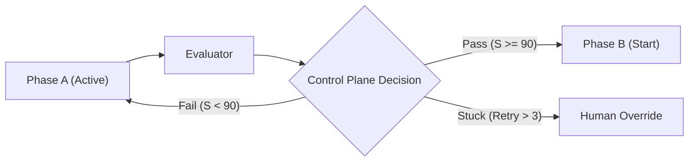

# Thiết kế chi tiết: Control Plane (Tháp Điều phối)

Control Plane là thực thể quản trị cao nhất trong hệ thống Agent Factory. Nó không trực tiếp viết code hay lập kế hoạch thực thi, mà đóng vai trò là **người giám sát và ra quyết định** dựa trên dữ liệu từ Planner và Evaluator.

## 1. Môi trường và Nhiệm vụ (Responsibilities)

Control Plane chịu trách nhiệm cho 4 trụ cột chính:

1.  **Loop Governance (Quản trị Vòng lặp)**: Quyết định khi nào một luồng công việc cần được thử lại (Retry), khi nào nên dừng (Stop) và khi nào cần yêu cầu con người can thiệp (Escalate).
2.  **Budget Control (Kiểm soát Ngân sách)**: Theo dõi và giới hạn mức tiêu thụ Token (LLM Costs) và thời gian thực thi (Time-to-complete).
3.  **Safety Guardrails (Rào chắn An toàn)**: Ngăn chặn các hành vi nguy hiểm (ví dụ: xóa file hệ thống, chỉnh sửa file Contract mà không được phép).
4.  **Phase Gating (Phê duyệt Chuyển pha)**: Đảm bảo đầu ra của Phase này (ví dụ: BA Spec) đạt chuẩn điểm số từ Evaluator trước khi mở khóa Phase tiếp theo (ví dụ: Architecture).

## 2. Cơ chế Ra quyết định (Decision Matrix)

Control Plane đưa ra quyết định dựa trên mô hình điểm số (Score-based) từ Evaluator:

| Điểm Evaluator (S) | Quyết định (Action) | Ghi chú |
| :--- | :--- | :--- |
| **S >= 90/100** | **Approve & Move** | Chuyển sang phase tiếp theo. |
| **70 <= S < 90** | **Feedback & Retry** | Yêu cầu Agent chỉnh sửa dựa trên chỉ dẫn cụ thể. |
| **S < 70 (Lần 1-2)** | **Refactor Plan** | Yêu cầu Planner tạo lại kế hoạch mới. |
| **S < 70 (Lần 3+)** | **Escalate** | Dừng hệ thống và gửi thông báo cho con người (Human-in-the-loop). |

## 3. Quản trị Ngân sách (Budget Enforcement)

Mỗi Task hoặc Project sẽ được cấp một hạn mức (Quota):
- **Token Quota**: Tổng số token tối đa cho phép.
- **Time Quota**: Thời gian thực thi tối đa (ví dụ: 30 phút cho 1 sub-task).

**Hành động khi vượt hạn mức**: Control Plane sẽ tự động ngắt kết nối với Agent Runtime và lưu trạng thái để chờ xử lý thủ công.

## 4. Rào chắn An toàn (Safety Guardrails)

Hệ thống lọc lệnh (Command Filtering) tại Control Plane:
- **Blacklisted Commands**: `rm -rf /`, `chmod 777`, v.v.
- **Contract Integrity**: Mọi lệnh ghi đè lên file `Contract.md` sẽ bị chặn (Exception: Khi có chỉ thị `FORCE_UPDATE_CONTRACT` từ người dùng).

## 5. Quy trình Chuyển pha (Phase Gate Flow)

---
> [!IMPORTANT]
> **Identity**: Control Plane là lớp bảo vệ cuối cùng trước khi các thay đổi được đẩy lên môi trường thực hiện của khách hàng. Nó phải hoạt động một cách khách quan và chặt chẽ nhất.
