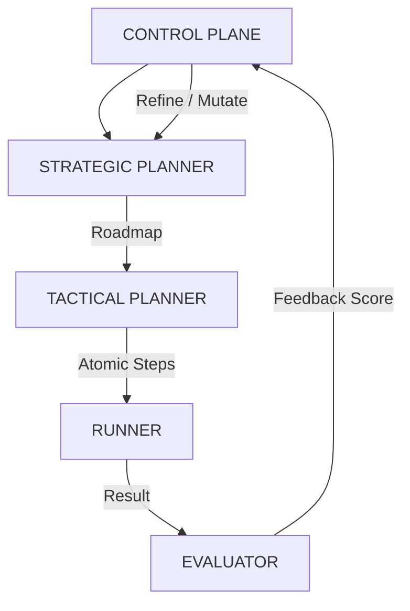

# Đặc tả kiến trúc: Hierarchical Planner (Bộ lập hoạch Phân tầng)

Bộ lập hoạch (Planner) trong Agent Factory không còn là một thực thể đơn nhất. Để giảm thiểu hiện tượng ảo giác (Hallucination) và tăng độ tin cậy của kế hoạch, Planner được phân thành hai tầng kiến trúc chuyên biệt.

## 1. Phân cấp Lập hoạch (Planner Hierarchy)

### 1.1. Strategic Planner (Bộ lập hoạch Chiến lược)
- **Vai trò**: Xác định mục tiêu tổng thể và lộ trình lớn (Roadmap).
- **Phạm vi**: Nhìn nhận toàn bộ dự án từ PRD đến Milestone.
- **Dữ liệu đầu ra**: Danh sách các "Giai đoạn" (Phases) và "Mốc quan trọng" (Milestones).
- **Trách nhiệm**: Đảm bảo dự án đi đúng hướng thiết kế ban đầu.

### 1.2. Tactical Planner (Bộ lập hoạch Thực thi/Chiến thuật)
- **Vai trò**: Chia nhỏ các Milestone thành các nhiệm vụ nguyên tử (Atomic Tasks).
- **Phạm vi**: Chỉ tập trung vào một Milestone duy nhất tại một thời điểm.
- **Dữ liệu đầu ra**: Danh sách các bước thực thi chi tiết cho Runner (ví dụ: `mkdir`, `npm install`, `write_file`).
- **Trách nhiệm**: Xử lý các tình huống retry, sửa lỗi cú pháp, và đảm bảo completion từng bước.

## 2. Quy trình Lập hoạch Đa phương án (Multi-Planner Workflow)

Để đạt được độ chính xác cao nhất, Control Plane có thể kích hoạt cơ chế **Multi-Planner**:

1.  **Sinh phương án**: Hai hoặc nhiều Planner (sử dụng các Model khác nhau hoặc Prompt khác nhau) cùng sinh ra kế hoạch cho một nhiệm vụ.
2.  **Đánh giá kế hoạch (Plan Evaluation)**: Một Agent Verifier độc lập sẽ chấm điểm các kế hoạch dựa trên:
    - Tính khả thi (Feasibility).
    - Độ an toàn (Safety).
    - Hiệu suất (Efficiency).
3.  **Lựa chọn (Selection)**: Lấy kế hoạch có điểm số cao nhất hoặc tổng hợp từ các kế hoạch tốt nhất.

## 3. Vòng lặp Hiệu chỉnh Kế hoạch (Plan Mutation)

Kế hoạch không phải là bất biến. Nó sẽ tự điều chỉnh dựa trên phản hồi từ Evaluator:

- **Nếu Task thất bại**: Tactical Planner sẽ thực hiện **Mutation** (Biến đổi) - thay đổi cách tiếp cận của bước đó dựa trên dữ liệu từ Failure Memory.
- **Nếu Milestone bế tắc**: Strategic Planner sẽ thực hiện **Refactoring** - thay đổi lộ trình lớn của dự án.

## 4. Tương tác với Control Plane & Runner

---
> [!NOTE]
> **Reality Check (Dự án AHV)**: Việc phân tầng này giúp hệ thống không bao giờ bị "quên" mục tiêu lớn (Strategic) trong khi đang mải mê sửa các lỗi nhỏ (Tactical). Đó chính là bí quyết để một Agent Autonomous có thể vận hành ổn định qua hàng chục Iteration.
