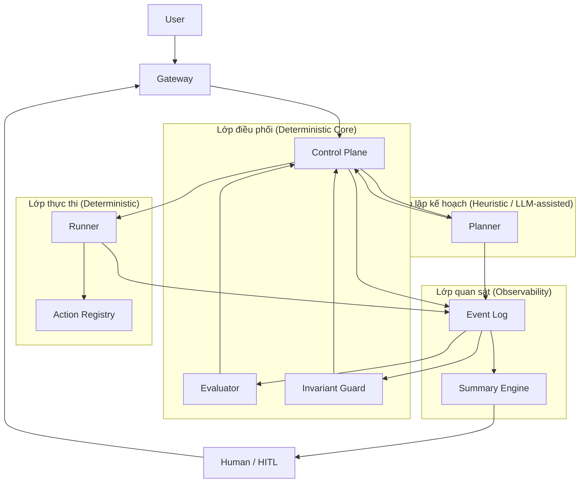

# Kiến trúc hệ thống: Mô hình tự vận hành (V4.7)

Tài liệu này xác định kiến trúc cốt lõi của hệ thống tác nhân tự vận hành, tập trung vào tính xác thực (deterministic) của lớp điều phối và khả năng quan sát (observability) của toàn hệ thống.

---

## 1. Sơ đồ quy trình tổng thể

---

## 2. Các lớp chức năng và trách nhiệm

### 2.1. Lớp điều phối (Control Layer)
Lớp điều phối đóng vai trò là hạt nhân xác thực của hệ thống, không phụ thuộc vào trí tuệ nhân tạo để đưa ra các quyết định luồng.
- **Control Plane**: Điều phối toàn bộ vòng lặp (loop), quyết định bước tiếp theo dựa trên logic xác thực.
- **Evaluator**: Kiểm tra kết quả thực thi dựa trên các tiêu chí định sẵn.
- **Invariant Guard**: Đảm bảo hệ thống không vi phạm các quy tắc bất biến (invariants) và rào cản an toàn.
- **Nguyên tắc**: Xác thực (deterministic), không "suy nghĩ" thay tác nhân, tập trung vào tính toàn vẹn của hệ thống.

### 2.2. Lớp lập kế hoạch (Planning Layer)
Sử dụng mô hình ngôn ngữ lớn (LLM) để đề xuất các phương án hành động trong các tình huống chưa có kịch bản định trước.
- **Planner**: Đề xuất hành động tiếp theo dựa trên ngữ cảnh hiện tại.
- **Giới hạn**: Chỉ đóng vai trò gợi ý (suggestion engine), không có quyền tự quyết định thực thi trực tiếp.

### 2.3. Lớp thực thi (Execution Layer)
Thực hiện các thao tác vật lý trên môi trường dựa trên chỉ thị từ lớp điều phối.
- **Runner**: Thực thi các hành động (API, shell, database...).
- **Action Registry**: Danh mục các hành động hợp lệ và cơ chế kiểm chứng tham số đầu vào.
- **Nguyên tắc**: Chỉ thực thi và trả về kết quả, không tham gia vào quá trình ra quyết định logic.

### 2.4. Lớp quan sát (Observability Layer)
Đóng vai trò là nguồn dữ liệu duy nhất về trạng thái và lịch sử của hệ thống.
- **Event Log**: Lưu trữ toàn bộ lịch sử hành động, kết quả, lỗi và trạng thái từ tất cả các lớp. Đây là căn cứ để các thành phần khác (Planner, Evaluator, Human) truy xuất thông tin.
- **Incident Summary Engine**: Phân tích nhật ký sự kiện để tạo ra các báo cáo tóm tắt súc tích, phục vụ quá trình can thiệp của con người khi hệ thống gặp sự cố.

### 2.5. Lớp con người (Human Layer - HITL)
Vai trò giám sát cấp cao và can thiệp trực tiếp khi hệ thống bị tắc nghẽn hoặc vượt quá khả năng tự xử lý.

---

## 3. Vòng lặp điều phối (Control Loop)

Quy trình vận hành tiêu chuẩn của hệ thống:
1. **Tiếp nhận**: Control Plane nhận yêu cầu từ người dùng hoặc hệ thống ngoại vi.
2. **Lập kế hoạch**: Control Plane gọi Planner để đề xuất hành động (tùy chọn).
3. **Xác thực**: Kiểm tra hành động đề xuất qua Invariant Guard và Action Registry.
4. **Thực thi**: Runner thực hiện hành động đã được phê duyệt.
5. **Ghi nhật ký**: Toàn bộ dữ liệu được ghi vào Event Log.
6. **Đánh giá**: Evaluator kiểm tra kết quả thực thi so với mục tiêu.
7. **Phản hồi**: Control Plane quyết định tiếp tục vòng lặp hoặc dừng lại. Nếu thất bại, hệ thống kích hoạt Summary Engine để thông báo cho con người.

---

## 4. Các nguyên tắc thiết kế cốt lõi

1. **Phân tách quyết định và thực thi**: Planner không phải là Executor. Control Plane không phụ thuộc vào LLM để duy trì cấu trúc luồng.
2. **Cô lập mô hình ngôn ngữ (LLM Sandboxing)**: LLM không có quyền truy cập trực tiếp vào hệ thống hoặc vượt qua các rào cản an toàn (invariants).
3. **Trung tâm dữ liệu sự kiện (Event-Centric)**: Hệ thống không thể vận hành hiệu quả nếu thiếu nhật ký sự kiện chi tiết.
4. **Khả năng gỡ lỗi (Debuggability)**: Thất bại không phải là vấn đề, nhưng không hiểu lý do thất bại là một lỗi hệ thống nghiêm trọng.

---

## 5. Lộ trình triển khai (Roadmap)

1. **Giai đoạn 1**: Xây dựng nền tảng thực thi (Runner, Action Registry) và hệ thống nhật ký (Event Log).
2. **Giai đoạn 2**: Thiết lập vòng lặp điều phối (Control Loop) cơ bản.
3. **Giai đoạn 3**: Ưu tiên xây dựng Incident Summary Engine để hỗ trợ quan sát.
4. **Giai đoạn 4**: Triển khai Invariant Guard để đảm bảo an toàn.
5. **Giai đoạn 5**: Tích hợp LLM Planner như một thành phần hỗ trợ tùy chọn.

---
> [!IMPORTANT]
> Mục tiêu tối thượng của kiến trúc này là xây dựng một hệ thống điều khiển xác thực có sự hỗ trợ của AI, thay vì một tác nhân AI tự do không thể kiểm soát.
