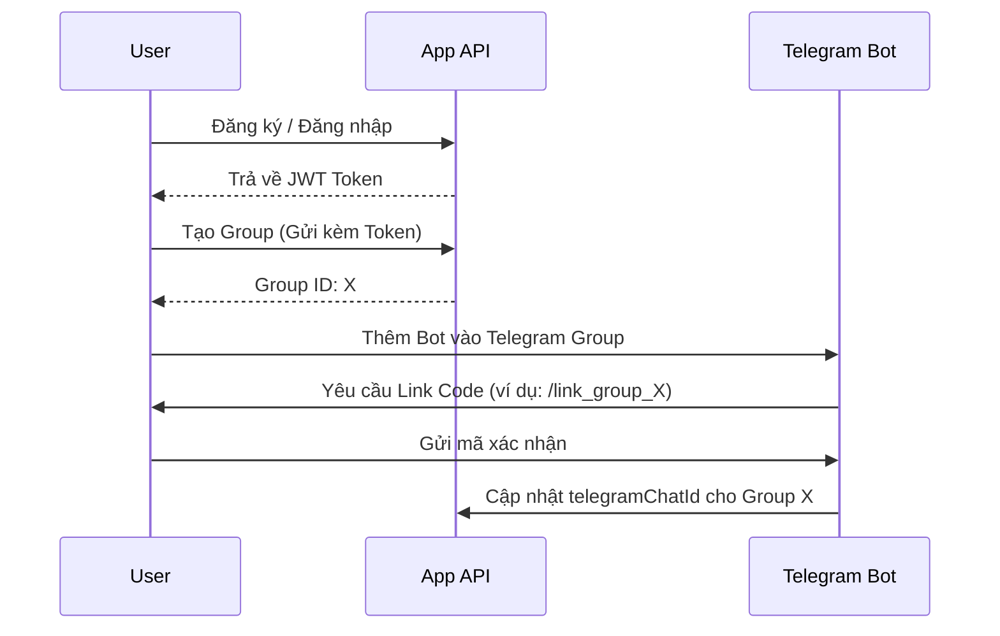
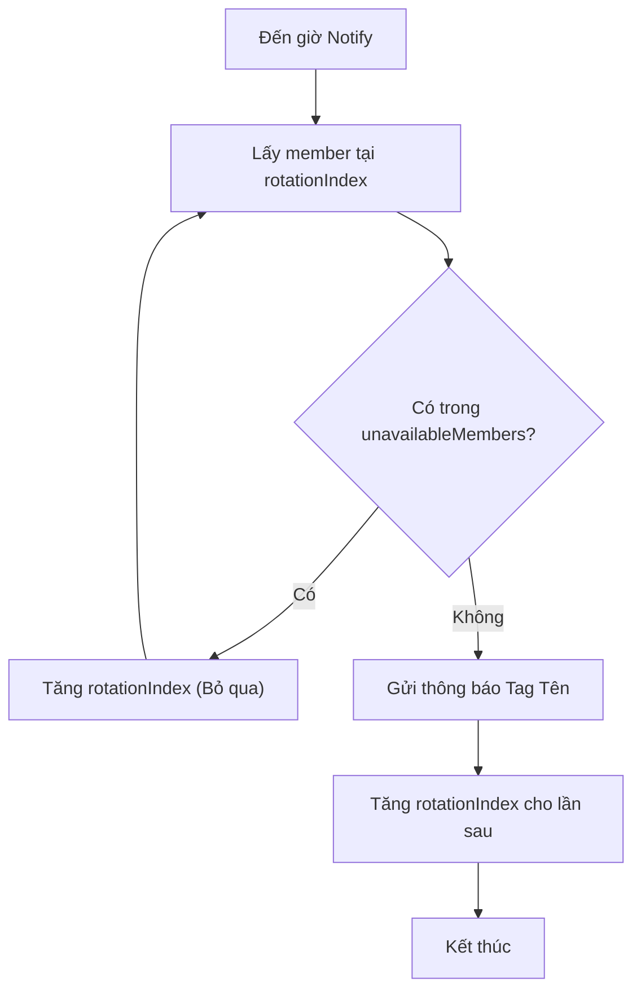
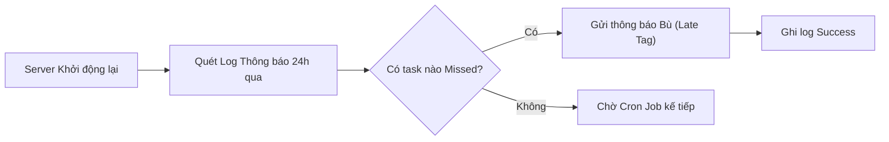

# User Flow: Daily Reminder System (DRS) - Bản Cập nhật

Tài liệu này mô tả các luồng tương tác đã được bổ sung cơ chế Auth và Rotation nâng cao.

## 1. Luồng Xác thực & Khởi tạo (Auth & Setup)

## 2. Luồng Xoay vòng với Skip Logic (Advanced Rotation)

Mô tả cách hệ thống chọn người phụ trách khi có thành viên vắng mặt.

## 3. Luồng Gửi thông báo Bù (Catch-up Flow)

---
> [!TIP]
> **Đặc biệt lưu ý**: Luồng **Bot Link** là bước quan trọng nhất để đảm bảo Bot có quyền tương tác với nhóm Telegram. Hãy đảm bảo Agent cài đặt Middleware kiểm tra JWT cho mọi Endpoint trong Luồng 1.
