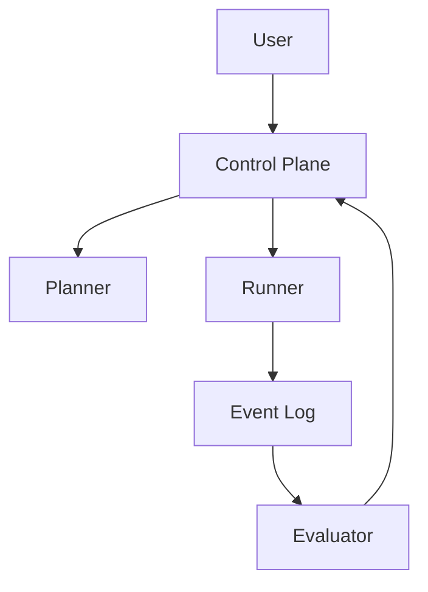

# System Overview

## 1. Problem Statement
👉 **Hệ thống này giải quyết vấn đề gì?**

Hệ thống V4.7 (Agent Factory) là một **Meta-System** được thiết kế để tự động hóa quá trình sinh, quản trị và tiến hóa các AI Agent. Nó giải quyết triệt để các vấn đề về:
- **Vòng lặp vô tận (Loop Crisis)**: Agent bị kẹt khi không đạt được mục tiêu.
- **Trôi dạt thiết kế (Design Drift)**: Agent tự ý thay đổi cấu trúc nền tảng.
- **Kiểm soát chi phí & An toàn**: Quản lý token và ngăn chặn hành vi nguy hiểm.

## 2. Goals
- **Build & Debug**: Dev mới đọc 1-2h hiểu hệ thống, Ops debug trong 5 phút.
- **Config-driven**: Tách biệt hoàn toàn logic điều phối và thực thi.
- **Self-evolution**: Khả năng tự rút kinh nghiệm từ thất bại (Failure Memory).

## 3. Non-Goals
- Không thay thế con người trong các quyết định chiến lược (Human-in-the-loop).
- Không tối ưu hóa từng Agent đơn lẻ mà tập trung vào Orchestration.

## 4. Core Philosophy
- **Deterministic control > AI autonomy**: Kiểm soát chặt chẽ vòng lặp.
- **Observability first**: Mọi hành động đều phải để lại dấu vết.
- **Fail must be explainable**: Thất bại phải có nguyên nhân và hướng xử lý rõ ràng.

## 5. High-level Flow

