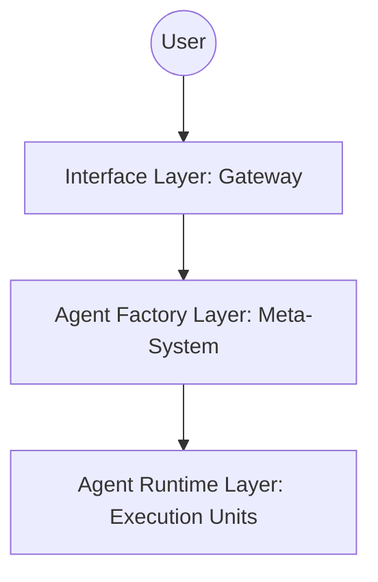

# System Overview

## 1. Problem Statement
👉 **Hệ thống này giải quyết vấn đề gì?**

Hệ thống V4.7 (Agent Factory) là một **Meta-System** được thiết kế để tự động hóa quá trình sinh, quản trị và tiến hóa các AI Agent. Nó giải quyết triệt để các vấn đề về:
- **Vòng lặp vô tận (Loop Crisis)**: Agent bị kẹt khi không đạt được mục tiêu.
- **Trôi dạt thiết kế (Design Drift)**: Agent tự ý thay đổi cấu trúc nền tảng.
- **Kiểm soát chi phí & An toàn**: Quản lý token và ngăn chặn hành vi nguy hiểm.

## 2. Goals
- **Build & Debug**: Dev mới đọc 1-2h hiểu hệ thống, Ops debug trong 5 phút.
- **Config-driven**: Tách biệt hoàn toàn logic thiết kế và thực thi.
- **Scalable Agency**: Khả năng sinh ra hàng loạt Agent chuyên biệt (Dev, Test, Research) từ một yêu cầu duy nhất.

## 3. Non-Goals
- Không thay thế con người trong các quyết định chiến lược (Human-in-the-loop).
- Không phải là một chatbot đơn thuần mà là một hệ thống thực thi tác vụ (Task Execution System).

## 4. Core Philosophy
- **Separation of Concerns**: Factory (Thiết kế) ≠ Runtime (Thực thi).
- **Agent = Disposable**: Agent được tạo ra cho một nhiệm vụ và có thể bị hủy sau khi xong.
- **Everything is Config**: Agent được định nghĩa bằng cấu hình, không hardcode logic.
- **Deterministic Execution**: LLM chỉ dùng để lập kế hoạch và thiết kế, việc thực thi phải đảm bảo tính xác định.

## 5. High-level Architecture (3-Layers)
👉 Hệ thống được chia thành 3 tầng chính:

1. **Interface Layer**: Gateway tiếp nhận và chuẩn hóa yêu cầu.
2. **Agent Factory Layer**: Meta-System thiết kế và sinh ra các Agent chuyên biệt.
3. **Agent Runtime Layer**: Các đơn vị thực thi tác vụ cụ thể (Dev, Test, v.v.).

