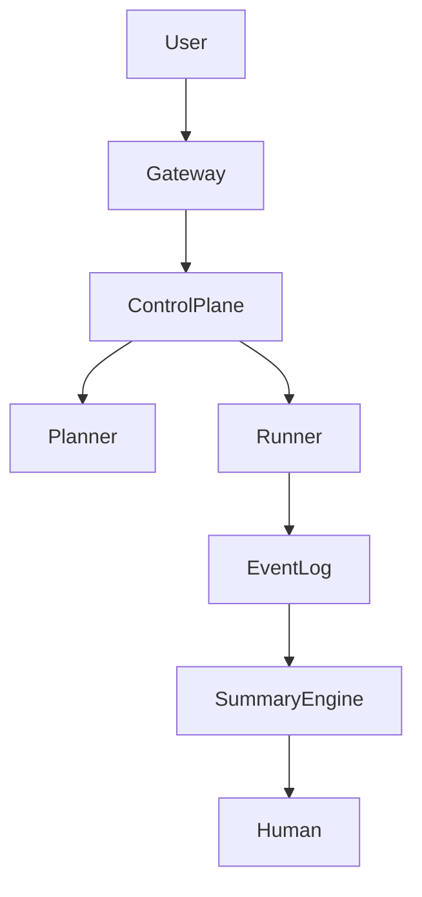

# Architecture Overview

## 1. Layers
V4.7 được chia làm 4 layer cốt lõi:
- **Control Layer**: Điều phối vòng lặp và đảm bảo quy tắc bất biến.
- **Planning Layer**: Hỗ trợ từ AI để đề xuất hành động.
- **Execution Layer**: Thực hiện thao tác vật lý trên môi trường.
- **Observability Layer**: Lưu trữ và phân tích nhật ký sự kiện.

## 2. Full Diagram

## 3. Data Flow
1. **Input**: User gửi Request qua Gateway tới Control Plane.
2. **Plan**: Control Plane hỏi Planner về bước tiếp theo.
3. **Run**: Runner thực thi Action được Planner đề xuất.
4. **Log**: Event Log ghi lại mọi kết quả và trạng thái.
5. **Human**: Summary Engine báo cáo cho Human nếu có sự cố hoặc cần phê duyệt.

## 4. Design Principles
* **Separation of concerns**: Tách biệt logic Plan và Execute.
* **Deterministic core**: Lớp điều phối chạy bằng logic code xác định.
* **Bounded AI**: Giới hạn quyền năng của LLM trong các Guardrails.
