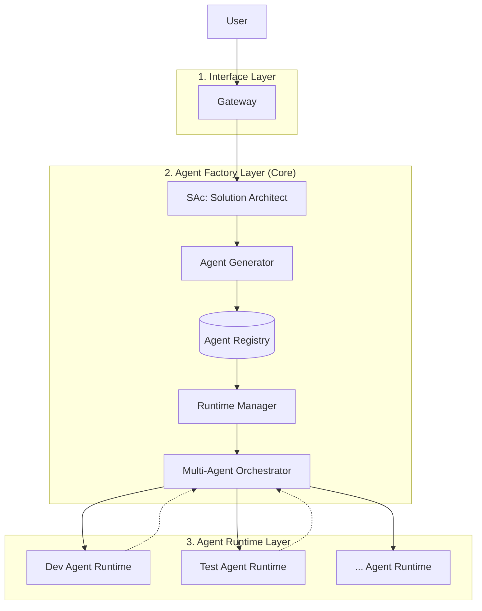

# Architecture Overview

## 1. Layers
Hệ thống V4.7 (Agent Factory) được kiến trúc theo 3 tầng chính để đảm bảo tính xác định và khả năng mở rộng:

- Interface Layer: Gateway tiếp nhận, chuẩn hóa yêu cầu và xác thực.
- Agent Factory Layer: "Bộ não" thiết kế, sinh ra và điều phối các đơn vị thực thi (Agent Runtimes).
- Agent Runtime Layer: Các tác nhân thực thi nhiệm vụ cụ thể (Dev, Test, Research, Data Processing).

## 2. Full Diagram (HLD)

## 3. Data Flow (End-to-End)
1. User Request: Người dùng gửi yêu cầu qua Gateway tới SAc (Solution Architect).
2. Design Solution: SAc phân tích yêu cầu, thiết kế bản vẽ (Blueprint) và quyết định luồng làm việc (Workflow).
3. Generate & Store: Agent Generator tạo ra định nghĩa cho các Agent (Prompt, Tool, Config) và lưu vào Agent Registry.
4. Provision: Runtime Manager khởi tạo các môi trường Agent Runtime tương ứng.
5. Orchestration: Multi-Agent Orchestrator điều phối luồng giao tiếp giữa các Agent (ví dụ: Dev thực thi -> Test kiểm tra -> Dev sửa lỗi).

## 4. Design Principles
* Separation of Concerns: Factory (Thiết kế) ≠ Runtime (Thực thi).
* Agent = Disposable: Agent được tạo ra và hủy bỏ linh hoạt theo nhu cầu công việc.
* Everything is Config: Agent được định nghĩa bằng cấu hình, cho phép tái sử dụng và kiểm soát phiên bản.
* LLM where it fits: LLM chỉ dùng để thiết kế (SAc) và lập kế hoạch hành động (Planner trong Runtime), việc thực thi phải deterministic.
