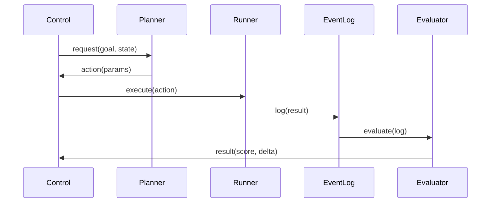

# Control Loop Runtime

## 1. Sequence


## 2. Pseudocode
```javascript
while (status !== 'GOAL_REACHED') {
  const action = await getPlan(state);
  if (await isSafe(action)) {
    const res = await run(action);
    const eval = await assessment(res);
    state = updateState(eval);
  }
}
```
