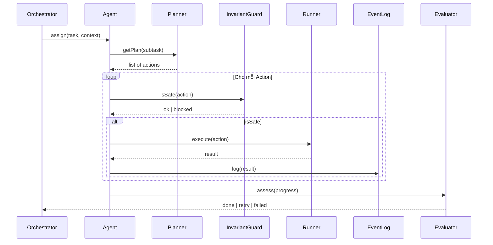

# Control Loop Runtime (Agent Level)

👉 **Vòng lặp bên trong một Agent Runtime**

Dự án V4.7 kế thừa và tinh gọn mô hình "Control Loop" từ các phiên bản trước đó, nhưng giới hạn nó trong phạm vi của một **Agent Runtime** đơn lẻ (như Dev Agent hoặc Test Agent).

## 1. Sequence (Bên trong Agent)


## 2. Pseudocode
```javascript
// Runtime loop within a single Agent
async function agentRuntime(task) {
  let state = task.initialContext;
  
  while (!goalReached(state)) {
    const nextAction = await getNextAction(task, state);
    
    if (await isSafe(nextAction)) {
      const result = await run(nextAction);
      updateLocalState(state, result);
      logEvent(result);
      
      const evaluation = await evaluate(state);
      if (evaluation.isSuccess) break;
    } else {
      handleBlockedAction(nextAction);
    }
  }
  
  return summarizeExecution(state);
}
```

## 3. Đặc điểm cốt lõi (Core Runtime Principles)
- **Local Focus**: Agent Runtime chỉ tập trung vào nhiệm vụ cụ thể được giao (Dev hoặc Test), không cần biết tổng thể mục tiêu của SAc.
- **Stateless Agent**: Agent có thể bị hủy đi và tái tạo lại từ Registry bất cứ lúc nào (Disposable).
- **Execution Responsibility**: Thực thi các thao tác nguyên tử (ghi file, chạy test, v.v.).
- **Feedback Loop**: Tối ưu hóa trong phạm vi nhiệm vụ thông qua Evaluator nội bộ.
