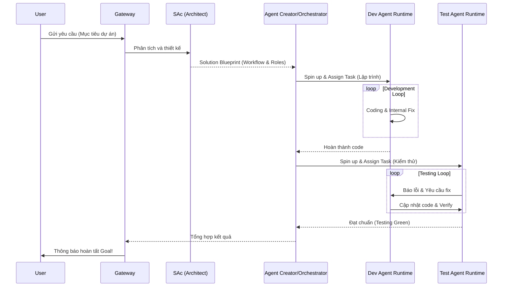

# Workflow End-to-End

Hành trình của một yêu cầu (User Request Flow)

Hệ thống V4.7 (Agent Factory) hoạt động thông qua một quy trình phối hợp đa tầng, từ khi nhận yêu cầu đến khi trả về kết quả cuối cùng.

## 1. Sequence Diagram (Tổng quát)

## 2. Các bước chi tiết (Step-by-Step)

### Step 1: User Request
- Thực thi: User → Gateway → SAc.
- Nhiệm vụ: Chuyển ý tưởng thành đặc tả kỹ thuật.

### Step 2: Thiết kế Solution
- Thực thi: SAc → Solution Blueprint.
- Hoạt động: Quyết định sử dụng Dev Agent, Test Agent và thiết lập vòng lặp (Fix loop).

### Step 3: Sinh ra Agent (Generate)
- Thực thi: Agent Generator → Agent Registry.
- Hoạt động: Tạo cấu hình (Prompt, Tool, Config) chuyên biệt cho từng tác nhân.

### Step 4: Khởi tạo Runtime (Provision)
- Thực thi: Runtime Manager → Spin up Agents.
- Hoạt động: Tạo môi trường cô lập cho Dev Agent và Test Agent.

### Step 5: Thực thi & Điều phối (Execution & Orchestration)
- Thực thi: Orchestrator → Điều phối Agents.
- Hoạt động: Chạy vòng lặp Dev → Test → Fix cho đến khi đạt mục tiêu.

### Step 6: Phản hồi & Tinh chỉnh (Feedback Loop)
- Thực thi: Evaluator / Invariant Guard.
- Hoạt động: Theo dõi tiến bộ (Delta), phát hiện vòng lặp vô tận hoặc sai sót và yêu cầu Orchestrator điều hướng lại.

## 3. Ví dụ thực tế: Xây dựng API đơn giản
- SAc: Quyết định dùng 1 Dev Agent (Node.js) và 1 Test Agent (Jest).
- Orchestrator:
    1. Yêu cầu Dev viết API endpoint.
    2. Gửi endpoint sang Test Agent để chạy bộ kiểm thử.
    3. Nếu Test Agent báo fail, gửi lỗi ngược lại cho Dev sửa.
    4. Lặp lại cho đến khi Test Agent báo success hoàn toàn.
- Kết luận: Gateway trả mã nguồn hoàn chỉnh cho User.
